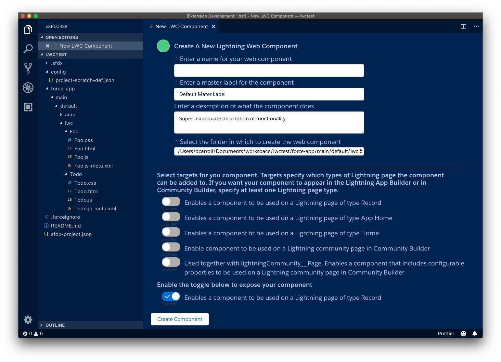

# sfdx-djc-extension README

[Download the VSIX here](https://github.com/dcarroll/sfdx-djc-lwcplugin/releases/download/0.0.1/lwc-create-0.0.1.vsix)
## Features

This extension provides an alternate way to create a Lightning Web Component (LWC) using VS Code and a web view for a richer developer experience.

Today to create an LWC you simply execute the command below.

```bash
sfdx force:lightning:component:create --componentname Foo --type lwc
```

In addition, you may specify the apiversion, outputdirectory and in the future a template.  This will create the files necessary for your component.  This is fine, except that LWCs have many other attributes that determine behavior and where they can be used.  So, to ensure that my component has a description, is visible in App Builder, can be home on a record home, etc the developer needs to understand the structure of the file used to set these behaviors as well as the correct keys and so on.  These are kept in the -meta.xml file for the specific LWC.

Editing XML, while may be a necessary evil, is something we should try to minimize if not hide entirely.  Below is a sample -meta.xml file for a component from the sample developer guide.

```xml
<?xml version="1.0" encoding="UTF-8"?>
<LightningComponentBundle xmlns="http://soap.sforce.com/2006/04/metadata">
  <apiVersion>45.0</apiVersion>
  <isExposed>true</isExposed>
  <masterLabel>Best Component Ever</masterLabel>
  <description>This is a demo component.</description>
  <targets>
      <target>lightning__RecordPage</target>
      <target>lightning__AppPage</target>
      <target>lightning__HomePage</target>
  </targets>
  <targetConfigs>
      <targetConfig targets="lightning__RecordPage">
          <property name="prop1" type="String" />
          <objects>
              <object>Account</object>
              <object>Opportunity</object>
              <object>Warehouse__c</object>
          </objects>
      </targetConfig>
      <targetConfig targets="lightning__AppPage, lightning_HomePage">
          <property name="prop2" type="Boolean" />
      </targetConfig>
  </targetConfigs>
</LightningComponentBundle>
```

As a developer you need to be first of all aware of the utility of this file (most metadata does not make extensive use of the -meta.xml file) and need to know all the XML for it.  There is a better way. We should consider making a new command for LWCs and add most of the top level XML elements as settable flags during creation of the component.  

```bash
sfdx force:lwc:create -n Foo —isexposed --masterlabel “Best Component Ever”
    --description “This is a bit short for a proper description”
    --targets 'recordpage,apppage'
```

I now have a component that I can code and easily push to test without futzing with XML.  Additionally, with this kind of command I can also create a richer IDE experience such as the one show below. (This was done prior to refactoring the -meta.xml XML element names)

Until the command is modified to enable this ability, we can instead, create an extension that collects all the relevant information, executes the existing form of the `lightning:component:create` command and then reflects the chosen attributes after the component is created.

That is what this extension actually does.

Here is what it looks like when invoked from the command pallette.




-----------------------------------------------------------------------------------------------------------

